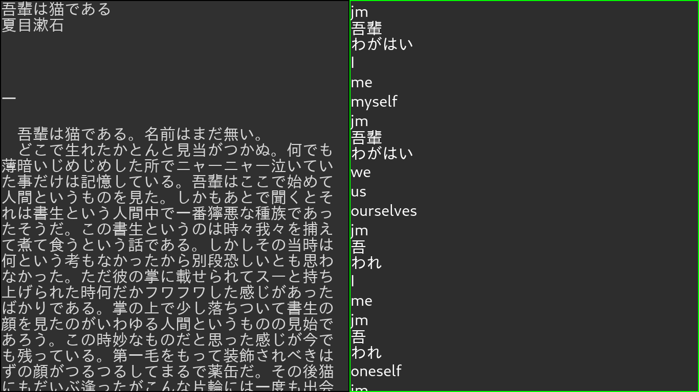

# DIRE: Dictionary Integrated Reading Environment

Dire is a dictionary program meant for language learners. When reading in a
foreign language learners will have to look up thousands of words. Therefore
Dire tries to make it as easy as possible to look up a word. Dire is able to
handle word conjugations languages without spaces (like Japanese), and works with
the dictionaries you use.

Also because Dire just handles text it works well for recursive lookups.

Dire is also extensible allowing for easy integration with other applications.

# Setup

## Quick setup

For a quick setup with some sensible defaults see.

quick.md

## Getting Dictionaries

See dicts.md

# Usage

See usage.md

# Configuraton

See config.md

# Licence
GPLv3 see LICENCE for more information

# Other projects
* yomichan: A big source of inspiration for this project. The reason I started this is because I wanted something like yomichan outside of the browser. https://foosoft.net/projects/yomichan/
* qolibi: Another Japanese dictionary which influenced several design decisions: https://github.com/ludios/qolibri
* Migaku dictionary: Another source of many good ideas. https://github.com/migaku-official/Migaku-Dictionary-Addon
